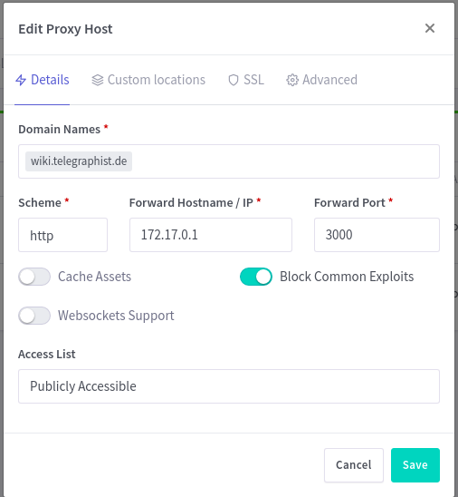
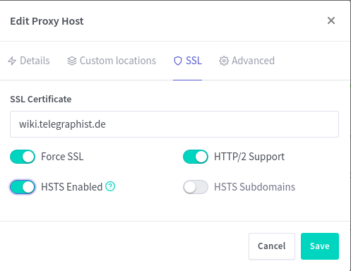

# Docker base image for Wikijs

The most powerful and extensible open source Wiki software. Based on the
[official WikiJS Docker][1] example.

[1]: https://github.com/Requarks/wiki/tree/dev/dev/containers

## Create a DNS A record for your sub domain that points to your server

Create a new A record on my server that is called “wiki.example.com” that
points to the public IP of the virtual server.

## Deploy Wikijs in docker

Create the docker-compose file. Create the new project folder in the `/opt
directory` called `wikijs`. Then I create a docker-compose.yaml file with the
following template.

```yml
version: "3"
services:

  db:
    image: postgres:11-alpine
    environment:
      POSTGRES_DB: ${DBNAME}
      POSTGRES_PASSWORD: ${DBPASSWD}
      POSTGRES_USER: ${DBUSER}
    logging:
      driver: "none"
    restart: unless-stopped
    volumes:
      - db-data:/var/lib/postgresql/data

  wiki:
    image: requarks/wiki:2
    depends_on:
      - db
    environment:
      DB_TYPE: postgres
      DB_HOST: db
      DB_PORT: 5432
      DB_USER: ${DBUSER}
      DB_PASS: ${DBPASSWD}
      DB_NAME: ${DBNAME}
    restart: unless-stopped
    ports:
      - "3000:3000"

volumes:
  db-data:
```

### The Password file

Store passwords in plain text is not a good idea. Create `.env` file with the
following content:

```yml
DBNAME=wiki
DBUSER=wikijs
DBPASSWD=wikijsrocks
```

**Notice:** Please change the names and take strong passwords, not wiki or
wikijs.

### Start Wikijs with the following command.

```sh
docker-compose up -d
```

### Login into the NGINX Proxy Manager

If the NGINX Proxy Manager, Docker and Docker Compose are installed on the same
server, the internal IP address is required.

```sh
ip addr show docker0
3: docker0: <NO-CARRIER,BROADCAST,MULTICAST,UP> mtu 1500 qdisc noqueue state DOWN group default
link/ether 02:42:5d:50:ff:be brd ff:ff:ff:ff:ff:ff
inet 172.17.0.1/16 brd 172.17.255.255 scope global docker0
valid_lft forever preferred_lft forever
```
** The IP Address is: ** `172.17.0.1`

## Set up an new Proxy Host

Configure the details.



## Set a Let's Encrypt certificate

Change to SSL.



## The result of the configuration

The configuration details.


## Login to the web UI of Wikijs

Now we can log in to the web UI. Simply use your browser to connect to your
server by using the IP address or an FQDN and connect on port “3000”. Next, you
should fill out the form ans thats it.

## Make comands to run stop and delete Wikijs

With this Makefile it is easy to control Wikijs.

```sh
make install         # install and run the App
make start           # start the App
make stop            # stop the App
make remove          # remove the App
make rm-database     # wipe the database
```
